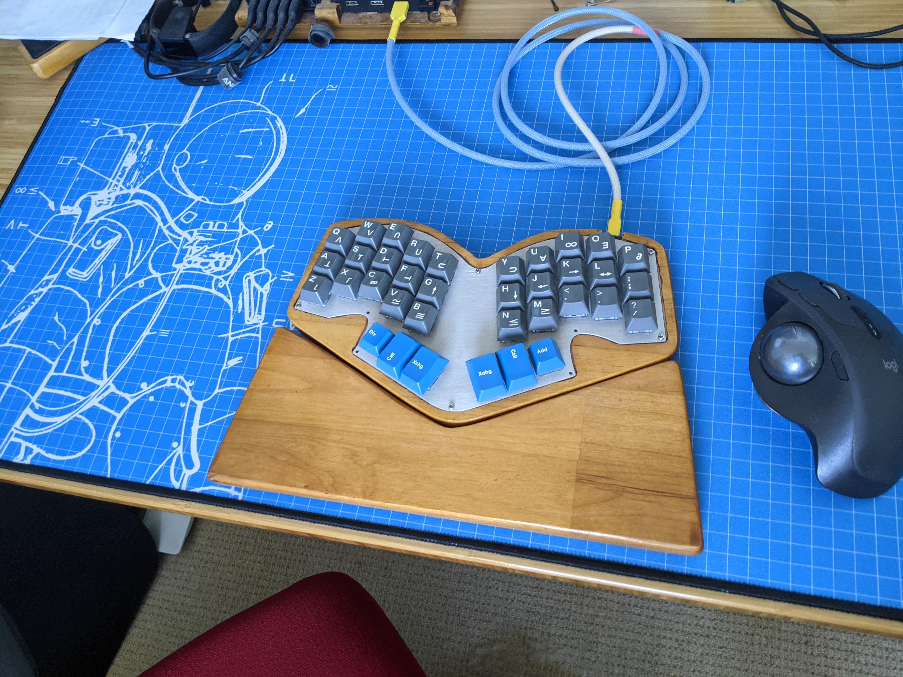

# keyboard

Personal opinionated keyboard and layout.



My keyboard maps ...

### Setup and flash

```bash
brew install qmk/qmk/qmk

# delete this directory and do again if you want the lastest
qmk setup ~/projects/qmk_firmware

cd keyboard/
./copy_qmk_files # assumes ../../qmk_firmware/
cd ../qmk_firmware/
make handwired/mrkabuda:ryan:avrdude
```


### Concepts

*macro vs ala carte*

There definitely seems to be a sweet spot between macro and ala carte directly
corresponding to use frequency. If you use something a lot a macro is great but
if you don't ala carte pieces are easier to remember (because each piece usage
is greated across tasks)

*flash/different keyboard vs layer*

Reflashing with different layers or having another keyboard handy to say change
between IDEs is reasonable (IntelliJ - VSCode)

*conceptual placement across different layers*

Many apps have similar concepts, new item, search item, etc. Along with 
functions editing items. Layers can be assigned to apps but reusing the 
placements can make working with the apps keycuts easier to remember.

- Shared: basic concepts/functionality
- Overides: might not bet exactly the same but similar in result
- Extentions: with other unassigned keys

*concept layer*

You can have a concept on a layers and have eash app take one line.
This is good for specialized concepts like debugging (play/pause, over, in, out)

```c
/* Concept-item
 * Layers: Vim-item, IntelliJ-item, Chrome-item, Devtools-item
 * Things beyond base will have to use app specific cuts/leaders
 * ,----------------------------------.  ,----------------------------------.
 * |  AN  |  SS  |  AS  |  FI  |  BM  |  |  NS  |  NI  |  CI  |  MI  |  DI  |
 * |------+------+------+------+-------  -------+------+------+------+------|
 * |  AC  |  HI  |  RI  |  PS  | FnP  |  |  PI  | Decl | Impl |  NI  |      |
 * |------+------+------+------+------|  |------+------+------+------+------|
 * | AF1  | AF2  | AF3  | AF4  | AF5  |  |  PT  |      |      |  NT  |      |
 * `------+------+------+------+------+  +------+------+------+------+------'
 *               | Help |  CL  |      |  |  U1  |  U2  |  U3  |
 *               `--------------------'  `--------------------'
 */

// Left
L01     Alternate Navigation (ie Navigation Bar)
L02     Search for sub-item from all
L03     Altenate search for sub-item from current item/panel, etc
L04     Find item
L05     Bookmarks

L11     Action/Commands
L12     History
L13     Recent items
L14     Project Structure
L15     Find In Project

L21     Goto Alternate File 1
L22     Goto Alternate File 2
L23     Goto Alternate File 3
L24     Goto Alternate File 4 (Test)
L25     Goto Alternate File 5

L33     Help
L34     Clear
L35     _______

// Right
R01     New scratch
R02     New item
R03     Copy item
R04     Move item
R05     Delete item

R11     Prev item
R12     Declaration
R13     Implementation
R14     Next item
R15     _______

R21     Nav prev
R22     _______
R23     _______
R24     Nav next
R25     _______

R31     Usages 1
R32     Usages 2
R33     Usages 3

```


```c
/* Concept-editor
 * Layers: Vim-editor, IntelliJ-editor
 * Most edtiing is in vim or with a vim plugin so will often use Vim-editor keymaps or vim itself.
 * ,----------------------------------.  ,----------------------------------.
 * |  WA  |  WR  |  PF  | IE1  | IE2  |  |  PB  |      |      |  NB  |      |
 * |------+------+------+------+-------  -------+------+------+------+------|
 * |  SA  |      |      |      |      |  |  PE  |  LD  |  LU  |  NE  |      |
 * |------+------+------+------+------|  |------+------+------+------+------|
 * |  HS  |  VS  |      | PLY  |      |  | PEr  |  SD  |  SU  | NEr  |      |
 * `------+------+------+------+------+  +------+------+------+------+------'
 *               |  G3  |  G2  |  G1  |  |  C1  |  C2  |  C3  |
 *               `--------------------'  `--------------------'
 */

// Left
L01     Write all
L02     Write
L03     Previous File
L04     Paste Last Yank
L05     _______

L11     Select all
L12     _______
L13     _______
L14     _______
L15     _______

L21     _______
L22     _______
L23     _______
L24     _______
L25     _______

L33     Generation Code 3
L34     Generation Code 2
L35     Generation Code 1

// Right
R01     Previous Bracket
R02     Item Explorer 2
R03     Item Explorer 1 (Tagbar, BTags, BLines)
R04     Next Bracket
R05     _______

R11     Prev edit
R12     Move line down
R13     Move line up
R14     Next edit
R15     _______

R21     Prev error
R22     Open line space down
R23     Open line space up
R24     Next error
R25     _______

R31     Completion 1
R32     Completion 2
R33     Completion 3

```


```c

/* Concept-git
 * Layers: Vim-git, IntelliJ-git
 * Things beyond base will have to use app specific cuts/leaders
 * ,----------------------------------.  ,----------------------------------.
 * |      |      |      |      |      |  |      |      |      |      |  HU  |
 * |------+------+------+------+-------  -------+------+------+------+------|
 * |  SH  |      |      |      |  B   |  |      |      |      |      |      |
 * |------+------+------+------+------|  |------+------+------+------+------|
 * |      |      |      |      |      |  |      |      |      |      |      |
 * `------+------+------+------+------+  +------+------+------+------+------'
 *               | PUSH |COMMIT| DIFF |  | LCFS |      |      |
 *               `--------------------'  `--------------------'
 */

// Left
L01     _______
L02     _______
L03     _______
L04     _______
L05     _______

L11     Show History of this file
L12     _______
L13     _______
L14     _______
L15     Blame

L21     _______
L22     _______
L23     _______
L24     _______
L25     _______

L33     Push
L34     Commit
L35     Diff it

// Right
R01     _______
R02     _______
R03     _______
R04     _______
R05     Hunk Undo

R11     _______
R12     _______
R13     _______
R14     _______
R15     _______

R21     _______
R22     _______
R23     _______
R24     _______
R25     _______

R31     Git log current file selection
R32     _______
R33     _______

```


```c

/* Concept-debug
 * Layers: IntelliJ, Devtools
 * Debug is a special mode with a limited set of function. This could be done on one line for each env.
 * ,----------------------------------.  ,----------------------------------.
 * |      |      |      |      |      |  |      |      |      |      |      | // Browser
 * |------+------+------+------+-------  -------+------+------+------+------|
 * |Debug |      |      | Eval | TgBP |  |  BP  | Play | Over |  In  | Out  | // IntelliJ
 * |------+------+------+------+------|  |------+------+------+------+------|
 * |      |      |      |      |      |  |      |      |      |      |      | // Vim
 * `------+------+------+------+------+  +------+------+------+------+------'
 *               |      |      |      |  |      |      |      |
 *               `--------------------'  `--------------------'
 */

// Left
L01
L02
L03
L04
L05

L11     Debug
L12     
L13     
L14     
L15     Eval

L21
L22
L23
L24
L25

L33
L34
L35

// Right
R01
R02
R03
R04
R05

R11     Break Points
R12     Play/Pause
R13     Over
R14     In
R15     Out

R21
R22
R23
R24
R25

R31
R32
R33

```


